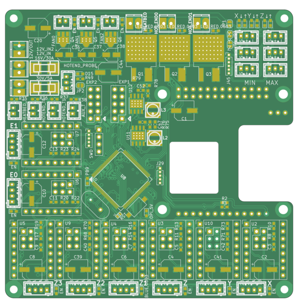

### PCB tryout for louis 3d printer

####  This is the front side of the board we are populating

####  This is the back side of the board we are populating

#### PCB look like:

### to initialize the stm32 with klipper firmware

to flash klipper with stm32duino:

#### `wget 'https://github.com/rogerclarkmelbourne/STM32duino-bootloader/raw/master/binaries/generic_boot20_pc13.bin'`

#### `st-flash /home/logic/_del/7/generic_boot20_pc13.bin 0x8000000`

#### `dfu-util -d 1eaf:0003 -a 2 -R -D out/klipper.bin`

#### to flash klipper with stm32duino:

to flash klipper by st-link

#### `st-flash write klipper.out 0x8000000`

#### to flash klipper by st-link

ref: <https://github.com/KevinOConnor/klipper/blob/master/docs/Bootloaders.md>

### TODO on this REV:

[x] tidy

[x] need to confirm about ~~PC13~~  PB9 as debug pin

